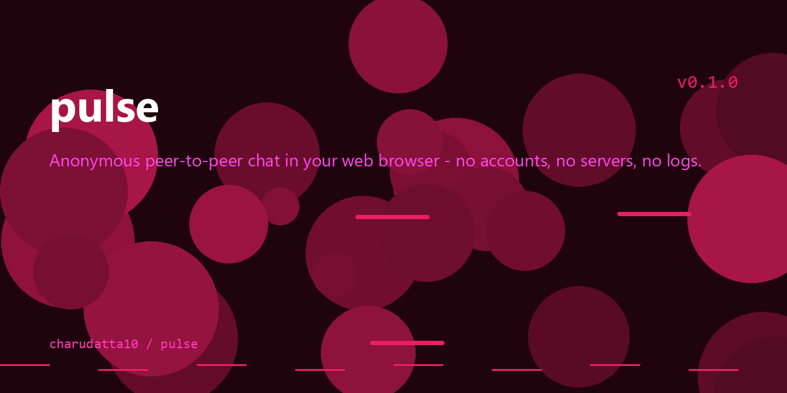

# pulse

<p align="center">
  
</p>


Anonymous peer-to-peer chat in your web browser. No accounts, no servers, no logs — everything runs directly between the two browsers over WebRTC.

A minimal, self-contained reimplementation of the reference in [`ref/`](ref) — a single `index.html`, no build step, no React.

## Usage

Open `index.html` in any browser (or host it on GitHub Pages), copy the generated link, and send it to the person you want to chat with. When they open it, you're connected.

- **Peer to peer** — direct connection between browsers via [PeerJS](https://peerjs.com)/WebRTC. Signaling happens over a public PeerJS broker; messages and files never touch it.
- **Anonymous** — no registration, no identity, just a random peer id.
- **No history** — everything disappears when you close the tab.
- **File sharing** — attach files (chunked transfer with progress), and download received ones.

## Tech

- [PeerJS](https://unpkg.com/peerjs@1.5.5/dist/peerjs.min.js) — WebRTC data connections
- [Alpine.js](https://unpkg.com/alpinejs@3.14.9/dist/cdn.min.js) — UI state, no framework build step
- Both loaded from CDN; the app itself is static HTML/CSS/JS in `index.html`

## Development

No build step. Serve the folder statically:

```sh
python -m http.server 8000
```

Open `http://localhost:8000` in two tabs and connect one to the other using its `#<peer-id>` link.

## Deployment (GitHub Pages)

Push to `main` and the [Pages workflow](.github/workflows/pages.yml) publishes `index.html` to GitHub Pages.

1. Go to **Settings → Pages**
2. Under **Source**, select **GitHub Actions** (the workflow replaces the legacy branch-based deployment)

Your site will then be live at `https://<user>.github.io/<repo>/`.

## License

This repository does not currently include a LICENSE file.
